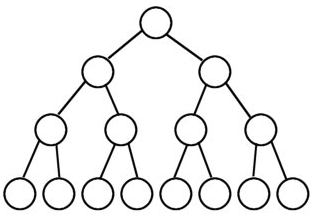
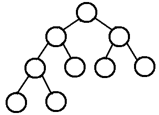
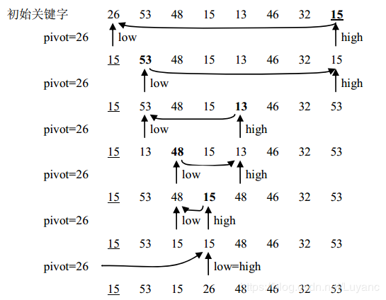

@[TOC]

# 一、概念
## （一）渐进时间复杂度（asymptotic time complexity）
官方的定义如下：  
若存在函数 f（n），使得当n趋近于无穷大时，T（n）/ f（n）的极限值为不等于零的常数，则称 f（n）是T（n）的同数量级函数。
记作 T（n）= O（f（n）），称O（f（n）） 为算法的渐进时间复杂度，简称时间复杂度。
渐进时间复杂度用大写O来表示，所以也被称为大O表示法。  
* T（n） = 3n   
最高阶项为3n，省去系数3，转化的时间复杂度为：  
T（n） =  O（n）
* T（n） = 5logn   
最高阶项为5logn，省去系数5，转化的时间复杂度为：  
T（n） =  O（logn）
* T（n） = 2  
只有常数量级，转化的时间复杂度为：  
T（n） =  O（1）
* T（n） = 0.5n^2 + 0.5n  
最高阶项为0.5n^2，省去系数0.5，转化的时间复杂度为：    
T（n） =  O（n^2）  
这四种时间复杂度究竟谁用时更长，谁节省时间呢？稍微思考一下就可以得出结论：  
O（1）< O（logn）< O（n）< O（n^2）  
在编程的世界中有着各种各样的算法，除了上述的四个场景，还有许多不同形式的时间复杂度，比如：  
O（nlogn）, O（n^3）, O（m*n），O（2^n），O（n！）  
## (二) 二叉树
* 满二叉树  
一棵二叉树的结点要么是叶子结点，要么它有两个子结点（如果一个二叉树的层数为K，且结点总数是(2^k) -1，则它就是满二叉树。）   

* 完全二叉树  
若设二叉树的深度为k，除第 k 层外，其它各层 (1～k-1) 的结点数都达到最大个数，第k 层所有的结点都连续集中在最左边，这就是完全二叉树。  

## 排序算法的稳定性
* 冒泡排序  
冒泡排序就是把小的元素往前调或者把大的元素往后调。比较是相邻的两个元素比较，交换也发生在这两个元素之间。所以，如果两个元素相等，我想你是不会再无聊地把他们俩交换一下的；如果两个相等的元素没有相邻，那么即使通过前面的两两交换把两个相邻起来，这时候也不会交换，所以相同元素的前后顺序并没有改变，所以冒泡排序是一种稳定排序算法。
* 选择排序  
选择排序是给每个位置选择当前元素最小的，比如给第一个位置选择最小的，在剩余元素里面给第二个元素选择第二小的，依次类推，直到第n - 1个元素，第n个元素不用选择了，因为只剩下它一个最大的元素了。那么，在一趟选择，如果当前元素比一个元素小，而该小的元素又出现在一个和当前元素相等的元素后面，那么交换后稳定性就被破坏了。比较拗口，举个例子，序列5 8 5 2 9，我们知道第一遍选择第1个元素5会和2交换，那么原序列中2个5的相对前后顺序就被破坏了，所以选择排序不是一个稳定的排序算法。
* 插入排序  
插入排序是在一个已经有序的小序列的基础上，一次插入一个元素。当然，刚开始这个有序的小序列只有1个元素，就是第一个元素。比较是从有序序列的末尾开始，也就是想要插入的元素和已经有序的最大者开始比起，如果比它大则直接插入在其后面，否则一直往前找直到找到它该插入的位置。如果碰见一个和插入元素相等的，那么插入元素把想插入的元素放在相等元素的后面。所以，相等元素的前后顺序没有改变，从原无序序列出去的顺序就是排好序后的顺序，所以插入排序是稳定的。
* 快速排序  
快速排序有两个方向，左边的i下标一直往右走，当a[i] <= a[center_index]，其中center_index是中枢元素的数组下标，一般取为数组第0个元素。而右边的j下标一直往左走，当a[j] > a[center_index]。如果i和j都走不动了，i <= j，交换a[i]和a[j],重复上面的过程，直到i > j。 交换a[j]和a[center_index]，完成一趟快速排序。在中枢元素和a[j]交换的时候，很有可能把前面的元素的稳定性打乱，比如序列为5 3 3 4 3 8 9 10 11，现在中枢元素5和3（第5个元素，下标从1开始计）交换就会把元素3的稳定性打乱，所以快速排序是一个不稳定的排序算法，不稳定发生在中枢元素和a[j] 交换的时刻。
* 归并排序  
归并排序是把序列递归地分成短序列，递归出口是短序列只有1个元素（认为直接有序）或者2个序列（1次比较和交换），然后把各个有序的段序列合并成一个有序的长序列，不断合并直到原序列全部排好序。可以发现，在1个或2个元素时，1个元素不会交换，2个元素如果大小相等也没有人故意交换，这不会破坏稳定性。那么，在短的有序序列合并的过程中，稳定是是否受到破坏？没有，合并过程中我们可以保证如果两个当前元素相等时，我们把处在前面的序列的元素保存在结果序列的前面，这样就保证了稳定性。所以，归并排序也是稳定的排序算法。
* 基数排序  
基数排序是按照低位先排序，然后收集；再按照高位排序，然后再收集；依次类推，直到最高位。有时候有些属性是有优先级顺序的，先按低优先级排序，再按高优先级排序，最后的次序就是高优先级高的在前，高优先级相同的低优先级高的在前。基数排序基于分别排序，分别收集，所以其是稳定的排序算法。
* 希尔排序(shell)  
希尔排序是按照不同步长对元素进行插入排序，当刚开始元素很无序的时候，步长最大，所以插入排序的元素个数很少，速度很快；当元素基本有序了，步长很小， 插入排序对于有序的序列效率很高。所以，希尔排序的时间复杂度会比O(n^2)好一些。由于多次插入排序，我们知道一次插入排序是稳定的，不会改变相同元素的相对顺序，但在不同的插入排序过程中，相同的元素可能在各自的插入排序中移动，最后其稳定性就会被打乱，所以shell排序是不稳定的。
* 堆排序  
我们知道堆的结构是节点i的孩子为2 * i和2 * i + 1节点，大顶堆要求父节点大于等于其2个子节点，小顶堆要求父节点小于等于其2个子节点。在一个长为n 的序列，堆排序的过程是从第n / 2开始和其子节点共3个值选择最大（大顶堆）或者最小（小顶堆），这3个元素之间的选择当然不会破坏稳定性。但当为n / 2 - 1， n / 2 - 2， ... 1这些个父节点选择元素时，就会破坏稳定性。有可能第n / 2个父节点交换把后面一个元素交换过去了，而第n / 2 - 1个父节点把后面一个相同的元素没 有交换，那么这2个相同的元素之间的稳定性就被破坏了。所以，堆排序不是稳定的排序算法。

综上，得出结论:   
稳定算法：冒泡排序、插入排序、归并排序、基数排序
不稳定算法 ：选择排序、快速排序、希尔排序、堆排序

稳定性的意义  
如果只是简单的进行数字的排序，那么稳定性将毫无意义。
如果排序的内容仅仅是一个复杂对象的某一个数字属性，那么稳定性依旧将毫无意义
如果要排序的内容是一个复杂对象的多个数字属性，但是其原本的初始顺序毫无意义，那么稳定性依旧将毫无意义。
除非要排序的内容是一个复杂对象的多个数字属性，且其原本的初始顺序存在意义，那么我们需要在二次排序的基础上保持原有排序的意义，才需要使用到稳定性的算法，例如要排序的内容是一组原本按照价格高低排序的对象，如今需要按照销量高低排序，使用稳定性算法，可以使得想同销量的对象依旧保持着价格高低的排序展现，只有销量不同的才会重新排序。（当然，如果需求不需要保持初始的排序意义，那么使用稳定性算法依旧将毫无意义）
换句话说，以某种关键字的方式排序后，能不影响到其他关键字原来排序结果的方法就是稳定的，比如一开始按照价格高低排序结果为 a(10元，卖了5个) b(8元，卖了20个) c(6元，卖了20个) d(4元，卖了30个),则按照销量重拍后如果保持 d(30个,价格为4元) b(20个，价格为8元) c(20个，价格为6元) a(5个，价格为10元)，则说明该方法为稳定的，而如果出现c在b前，破坏了排序前b在c前的顺序，则说明这个方法是不稳定的  

又可以参考：https://blog.csdn.net/qq_43152052/article/details/100078825

# 二、算法
## 冒泡排序bubblesort
https://github.com/kelvinliu11/meteor/blob/master/bubblesort
* 冒泡排序  
    * 冒泡排序，每次比较都是从0号元素开始，一次比较0-1,1-2,2-3...，一次循环结束，最大的元素放在n-1号最大的位置。
    * 下一次比较也是从0号元素开始，只是最大的元素已经在n-1位置，那么n-1位置不需要参与循环比较
    * 相比与普通的冒泡排序，可以减少比较的次数： 如果在一次冒泡过程中，一次交换都没有执行，那么整个数组就已经是排序的状态了
    * 总共比较的次数是不定的：最多是(n-1)+(n-2)+...+1 = (n-1)*n/2 = 1/2*n² - 1/2*n，那么最大的时间复杂度为O(n²)；最少是n-1次，最小的时间复杂度是O(n)

* 归并排序
    * [left ~ middle]和[middle+1, right]进行merge，并保持left ~ right之间由小到大排序
    * 新建一个长度为right-left+1长度的数组newArray
    * 设2个指针pLeft和pRight，初始pLeft=left，pRight=middle+1。每次找到pLeft和pRight中较小的一个，放入到newArray中，放入newArray用下标targetIndex
    * 待pLeft=middle&&pRight=right，表明merge结束，此时需要将newArray中的数据拷贝到origin中的left ~ right下标段处。

    
## 选择排序bubblesort
https://github.com/kelvinliu11/meteor/blob/master/bubblesort
* 选择排序  
    * 选择排序，由小到大输出：每次都是从底最后一个，跟其上面的所有数据做比较，每次比较过程中，用minIndex来记录这一轮最小数的下标，待结束后放在较小的存在0号位置。
    * 注意的就是不要没一个比较的时候直接交换，只记录下标，等到内层循环结束之后再做交换
    * 总共比较的次数是一定的：(n-1)+(n-2)+...+1 = (n-1)*n/2 = 1/2*n² - 1/2*n，那么时间复杂度为O(n²)

## 插入排序bubblesort
https://github.com/kelvinliu11/meteor/blob/master/bubblesort
* 插入排序
    * 插入排序：让元素i之前的元素都保持由小到大排序，每次比较都是跟当前元素之前的所有元素进行比较。好比从牌堆里面摸牌，摸出来的牌每次都要从手上的牌从后往前理一遍。
    * 思路是从下标1元素开始，跟之前的所有元素比较，如果当前元素比前一个元素小，那么就进行交换。这样，每一轮下来，位置i的元素会被安排到合适的位置。
    * tips：如果当前比对的元素，比之前的一个元素要大，那么就可以不继续了，因为前前一个元素一定是比前一个元素小的
    * 图形化的演示http://cmsblogs.com/?p=4688    
    * 总共比较的次数是不定的：最多是(n-1)+(n-2)+...+1 = (n-1)*n/2 = 1/2*n² - 1/2*n，那么最大的时间复杂度为O(n²)；最少是n-1次，最小的时间复杂度是O(n)

## 小和问题littlesum
https://github.com/kelvinliu11/meteor/blob/master/littlesum/readme.md
* 小和问题
在一个数组中， 每一个数左边比当前数小的数累加起来， 叫做这个数组的小和。 求一个数组
的小和。  
例子：  
[1,3,4,2,5]  
1左边比1小的数， 没有；  
3左边比3小的数， 1；  
4左边比4小的数， 1、 3；  
2左边比2小的数， 1；  
5左边比5小的数， 1、 3、 4、 2；  
所以小和为1+1+3+1+1+3+4+2=16  
* 实现方案
    * 递归调用，主要的逻辑就是把数组拆分成2个子列，分别对子列进行小和计算，并且把子列小和计算的结果进行累加   
    * 将[left,right]分成2个子列->[left,right/2],[right/2+1,right]，将第二个子列从right/2+1开始，逐一和第一个子列的元素进行比较，如果左侧比右侧元素小，则累加到tmpSum中

## 快速排序quicksort
https://github.com/kelvinliu11/meteor/blob/master/quicksort
 * 快速排序的思想：
     * 快速排序是将分治法运用到排序问题中的一个典型例子，其基本思想是：
     * 通过一个枢轴（pivot）元素将 n 个元素的序列分为左、右两个子序列 Ll 和 Lr，其中子序列 Ll中的元素均比枢轴元素小，而子序列 Lr 中的元素均比枢轴元素大，
     * 然后对左、右子序列分别进行快速排序，在将左、右子序列排好序后，则整个序列有序，
     * 而对左右子序列的排序过程直到子序列中只包含一个元素时结束，此时左、右子序列由于只包含一个元素则自然有序。
 
 * 对待排序序列进行划分（一次循环的过程）：
     * 使用两个指针 low 和 high 分别指向待划分序列 r 的范围，取 low 所指元素为枢轴，即 pivot = r[low]。
     * 划分首先从 high 所指位置的元素起向前逐一搜索到第一个比 pivot 小的元素，并将其设置到 low 所指的位置；
     * 然后从 low 所指位置的元素起向后逐一搜索到第一个比 pivot 大的元素，并将其设置到 high 所指的位置；
     * 不断重复上述两步直到 low = high 为止，最后将 pivot 设置到 low 与 high 共同指向的位置。
 
 下图是一次循环的过程
 
 
 
## 荷兰国旗问题hollandflagproblem
https://github.com/kelvinliu11/meteor/blob/master/hollandflagproblem
* 题设
    * 假定就是一堆0,1,2的数字散列在数组中，要求排序后，按照0,1,2的顺序排列。
* 思路
    * 对于给定的数组arr[]，设定3个指针，begin， current，end。其中begin指向起始位置，current也指向起始位置，end指向末尾。current从头开始遍历整个数组。
    * current不断前移，当current为0的时候，将current和begin所指的元素交换。交换后，begin++， current++
    * current继续前移，当current为1的时候，current++
    * current继续前移，当current为2的时候，将current和end所指的元素交换。交换后，current不动，end--
* 参考文档
    * https://www.cnblogs.com/liuzhen1995/p/6439429.html
    
 ## 堆排序heapsort
 https://github.com/kelvinliu11/meteor/blob/master/heapsort
 * 题设
     * 完全二叉树概念。
     * 堆概念，大顶堆、小顶堆。
 * 思路  
     * 将无需序列构建成一个堆，根据升序降序需求选择大顶堆或小顶堆;  
     * 将堆顶元素与末尾元素交换，将最大元素"沉"到数组末端;  
     * 重新调整结构，使其满足堆定义，然后继续交换堆顶元素与当前末尾元素，反复执行调整+交换步骤，直到整个序列有序。
 * 参考文档
     * https://blog.csdn.net/qq_36186690/article/details/82505569
 
 
