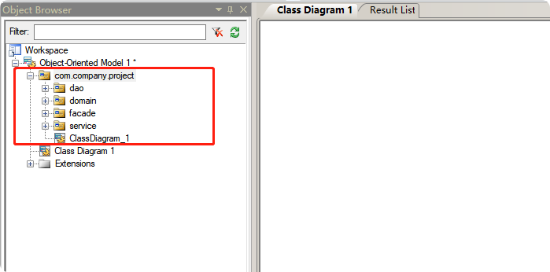
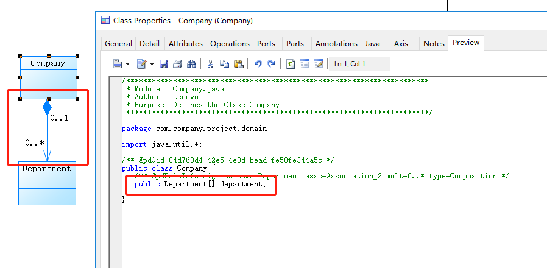

<!-- TOC -->

- [1. 为什么要画类图？](#1-为什么要画类图)
- [2. 环境准备](#2-环境准备)
- [3. 创建类图](#3-创建类图)
- [4. 常用类型、连线](#4-常用类型连线)
    - [4.1. 先要规划好包package的层级结构](#41-先要规划好包package的层级结构)
    - [4.2. 在powerdesign中创建package](#42-在powerdesign中创建package)
    - [4.3. 在画图之前，先理解一下要画什么图形？要怎么连线？](#43-在画图之前先理解一下要画什么图形要怎么连线)
        - [4.3.1. 绘制抽象类Person，含基本属性和方法](#431-绘制抽象类person含基本属性和方法)
        - [4.3.2. 绘制实现类extends，举例：Man extends Person](#432-绘制实现类extends举例man-extends-person)
        - [4.3.3. 绘制接口和实现类](#433-绘制接口和实现类)
        - [4.3.4. 关联（Association)、聚合（Aggregation）、组合(Composition)、依赖(Dependency)](#434-关联association聚合aggregation组合composition依赖dependency)
            - [4.3.4.1. 关联关系（只是属性引用），画图用Association。比如在facade中有个service作为属性，这就是关联关系。](#4341-关联关系只是属性引用画图用association比如在facade中有个service作为属性这就是关联关系)
            - [4.3.4.2. 聚合关系（属性引用，可分别独立存在），画图用Aggregation。比如车和轮胎是整体和部分的关系,轮胎离开车仍然可以存在](#4342-聚合关系属性引用可分别独立存在画图用aggregation比如车和轮胎是整体和部分的关系轮胎离开车仍然可以存在)
            - [4.3.4.3. 组合关系（属性引用，不可独立存在），画图用Compositon。比如公司和部门是整体和部分的关系, 没有公司就不存在部门](#4343-组合关系属性引用不可独立存在画图用compositon比如公司和部门是整体和部分的关系-没有公司就不存在部门)
            - [4.3.4.4. 依赖关系（非属性，如局部变量），画图用Dependency。比如学校通知学生开学的方法里，要用到学生类型](#4344-依赖关系非属性如局部变量画图用dependency比如学校通知学生开学的方法里要用到学生类型)
        - [4.3.5. 如何画抽象类？](#435-如何画抽象类)
        - [4.3.6. 如何画属性？](#436-如何画属性)
        - [4.3.7. 如何画方法？](#437-如何画方法)
        - [4.3.8. 如何画方法入参和反参？](#438-如何画方法入参和反参)
        - [4.3.9. 如何画泛型？](#439-如何画泛型)
        - [4.3.10. 如何创建一个快捷方式？](#4310-如何创建一个快捷方式)
        - [4.3.11. 如何快速的找到定义的Class？](#4311-如何快速的找到定义的class)
        - [4.3.12. 不能在2个快捷方式之间连线，除非就是简单的Link](#4312-不能在2个快捷方式之间连线除非就是简单的link)
        - [4.3.13. *、0..1、1..1等的含义](#4313-0111等的含义)
- [5. 类图生成Java代码](#5-类图生成java代码)
- [6. Java代码生成类图](#6-java代码生成类图)

<!-- /TOC -->

# 1. 为什么要画类图？
有了它整个项目的类结构更加清晰,或者说一个刚入职进入项目组的成员能更快的了解整个项目。  
当一个新的项目产生，类图可以从宏观上体现领域模型。  
# 2. 环境准备
使用的是powerdesign15.5版本，自行百度下载安装

# 3. 创建类图
  
又或者新建一个类图
  

# 4. 常用类型、连线
## 4.1. 先要规划好包package的层级结构
这个属于在写代码前，先把项目的包目录结构先定义清楚。一般情况下我们由dao、service、facade三层组织。  
* dao：可以是mybatis的mapper或逆向生成的dao类  
* service：是dao的具体实现，一般不会出现service之间的相互调用
* facade：门面，作用是包装多个service，进而实现一定复杂度的业务逻辑
## 4.2. 在powerdesign中创建package
这里要求我们把package预先设定好  
  
建好的package层级如下  
  
## 4.3. 在画图之前，先理解一下要画什么图形？要怎么连线？
### 4.3.1. 绘制抽象类Person，含基本属性和方法
  

预览抽象类生成的代码  

### 4.3.2. 绘制实现类extends，举例：Man extends Person

连线，说明Man extends Person  

Man类会自动生成extends语句

### 4.3.3. 绘制接口和实现类
如何绘制接口？  

实现类和接口的连线也是用Generalization

### 4.3.4. 关联（Association)、聚合（Aggregation）、组合(Composition)、依赖(Dependency)
先来个网上的结论（注：这个描述的不清楚，简单看看，然后看下面的例子）
* 关联关系：关系对象出现在实例变量中 
* 依赖关系：关系对象出现在局部变量或者方法的参数里，或者关系类的静态方法被调用 
* 聚合关系: 关系对象出现在实例变量中 
* 组合关系：关系对象出现在实例变量中 
* 泛化关系: extends 
* 实现： implements  

可以看到，“依赖关系”说的比较清楚，其他的几个就等于没说了。要结合具体的案例说明：  
#### 4.3.4.1. 关联关系（只是属性引用），画图用Association。比如在facade中有个service作为属性，这就是关联关系。
解释：  
就是一个对象facade中持有对象service的引用,这样对象service中的属性和方法facade也就知道了,就是这个意思,在实际的代码中体现在一个类上声明一个成员变量

tips: 
* 箭头及指向:带普通箭头的实心线，指向被拥有者
* 连接线，默认的是0..*，生成的属性代码是数组类型。所以要双击连线，在detail中更改

改完之后看看PersonFacade自动生成的代码差异

#### 4.3.4.2. 聚合关系（属性引用，可分别独立存在），画图用Aggregation。比如车和轮胎是整体和部分的关系,轮胎离开车仍然可以存在
解释：  
是整体与部分的关系, 且部分可以离开整体而单独存在,如车和轮胎是整体和部分的关系,轮胎离开车仍然可以存在  
聚合关系是关联关系的一种，是强的关联关系；关联和聚合在语法上无法区分，必须考察具体的逻辑关系  
比如一个学校有高中部和初中部,这些学生加起来都是属于这个学校的,那从聚合的概念上讲整体就是这个学校,部分就是学生了,且部分可以离开整体而单独存在,这意思是说学生可以转校去别的学校,但是这个学校还是存在的,不会因为一个学生转校了找个学校就没了  

tips：  
* 箭头指向:带空心菱形的实心线，菱形指向整体

#### 4.3.4.3. 组合关系（属性引用，不可独立存在），画图用Compositon。比如公司和部门是整体和部分的关系, 没有公司就不存在部门
解释：  
是整体与部分的关系, 但部分不能离开整体而单独存在. 如公司和部门是整体和部分的关系, 没有公司就不存在部门  
组合关系是关联关系的一种，是比聚合关系还要强的关系，它要求普通的聚合关系中代表整体的对象负责代表部分的对象的生命周期  
代码体现:成员变量  

tips：
箭头指向:带实心菱形的实线,菱形指向整体
自动生成的代码如下：

#### 4.3.4.4. 依赖关系（非属性，如局部变量），画图用Dependency。比如学校通知学生开学的方法里，要用到学生类型
解释：  
是一种使用的关系,  即一个类的实现需要另一个类的协助,所以要尽量不使用双向的互相依赖  
代码表现:局部变量、方法的参数或者对静态方法的调用  

tips：  
* 箭头指向：带箭头的虚线，指向被使用者  
自动生成的代码如下：  

### 4.3.5. 如何画抽象类？
仍然选择Class，在Class面板的General中勾选Abstract  

### 4.3.6. 如何画属性？

### 4.3.7. 如何画方法？

### 4.3.8. 如何画方法入参和反参？

### 4.3.9. 如何画泛型？

生成的泛型代码

### 4.3.10. 如何创建一个快捷方式？
为什么需要快捷方式？  
举个例子，在facade层，我们需要用到service的接口，并且facade和接口之间是关联关系Association。  
如果我们不用快捷方式，那总不能在facade的设计面板里再画一个service的Class，那这个时候就需要用到快捷方式：即直接拖拽service到facade的画板里。  
这样，我们就可以组织一个全面的关联关系，来表述facade和service之间的关系。  

### 4.3.11. 如何快速的找到定义的Class？
在实际工作中，有时候为了画一个完整的逻辑关系，会用到不少Class的快捷方式，快捷方式双击是无法打开Class对话框的，那如何找到该Class的定义呢？  
找到要找的Class类  

输入要找的类名称  

即可找到  

### 4.3.12. 不能在2个快捷方式之间连线，除非就是简单的Link
2个快捷之间无法画关系连线。快捷和实际Class之间可以画关系连线。  

简单的Link  

Link的效果  

### 4.3.13. *、0..1、1..1等的含义

怎么调整数量关系？双击连线进行修改  

以上可以看出，如果在Department处是0..*或者1..*，那么在Company中的Department属性就是数组  
如果在Department处是0..1或者1..1，那么在Company中的Department属性就是单元素属性  
所以：一般情况下，要修改成1..1  

# 5. 类图生成Java代码

# 6. Java代码生成类图
* 如果是想单个的Java文件或在一个目录下的几个Java文件生成类图，那么这么操作：  

  
* 如果是想把整个目录下的Java代码生成类图，那么这么操作：    

生成的图会比较细致（其实就是乱），需要自行调整